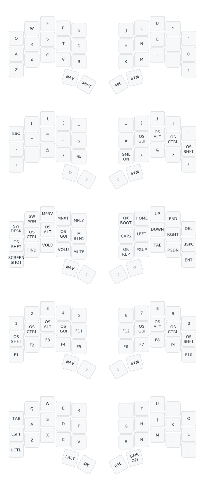

A keymap for 34 keys with 5 layers and no mod-tap.

Modified version of Callum Oakley's ferris 34 key keymap for the ferris sweep, including a gaming layer to mirror QWERTY and have your WASD fingers on the correct finger column.

  ~ grant24




## Flash & Compile commands:

```
qmk compile -kb ferris/sweep -km grant24

qmk flash -kb ferris/sweep -km grant24 -e CONVERT_TO=promicro_rp2040
```
Using the Frood pro-micro drop-in replacement: [GitHub](https://github.com/piit79/Frood)


## Details

- Hold `sym` to activate the symbols layer.
- Hold `nav` to activate the navigation layer.
- Hold `sym` and `nav` together to activate the numbers layer.
- The home row modifiers are oneshot so that it's possible to modify the
  keys on the base layer, where there are no dedicated modifiers.
- `swap win` sends `alt-tab` for changing focus but holds `alt`
  between consecutive presses.
- `swap desk` behaves similarly but sends `gui-tab`, for changing desktop worksapace.

## Oneshot modifiers

The home row modifiers can either be held and used as normal, or if no other
keys are pressed while a modifier is down, the modifier will be queued and
applied to the next non-modifier keypress. For example to type `shift-cmd-t`,
type `sym-o-n` (or `nav-a-t`), release, then hit `t`.

You can and should hit chords as fast as you like because there are no timers
involved.

Cancel unused modifiers by tapping `nav` or `sym`.

### Userspace oneshot implementation

For my usage patterns I was hitting stuck modifiers frequently with [`OSM`][]
(maybe related to [#3963][]?). I'd like to try to help fix this in QMK proper,
but implementing oneshot mods in userspace first was:

1. Fun.
2. A good exploration of how I think oneshot mods should work without timers.

So in the meantime, this [userspace oneshot implementation][] is working well
for me.

## Swapper

`swap win` sends `cmd-tab`, but holds `cmd` between consecutive keypresses.
`cmd` is released when some other key is hit or released. For example

    nav down, swap win, swap win, nav up -> cmd down, tab, tab, cmd up
    nav down, swap win, enter -> cmd down, tab, cmd up, enter

`swap lang` sends `ctrl-space` to swap input languages in macOS and behaves
similarly.

[Swapper implementation.][]

## Why no mod-tap?

[Mod-tap][] seems to be by far the most popular tool among users of tiny
keyboards to answer the question of where to put the modifiers, and in the
right hands it can clearly work brilliantly, but I've always found myself error
prone and inconsistent with it.

With dedicated modifiers, there are three ways one might type `ctrl-c`:

    ctrl down, ctrl up, c down, c up
    ctrl down, c down, ctrl up, c up
    ctrl down, c down, c up, ctrl up

Basically, you never have to worry about the keyups, as long as the keydowns
occur in the correct order. Similarly, there are three ways one might type
`ac`:

    a down, a up, c down, c up
    a down, c down, a up, c up
    a down, c down, c up, a up

Replace `a` with `ctrl` and this is exactly what we had before! So if we want
to put `a` and `ctrl` on the same key we have a problem, because without
considering timing these sequences become ambiguous. So let's consider timing.

The solution to the ambiguity that QMK employs is to configure the
`TAPPING_TERM` and consider a key held rather than tapped if it is held for
long enough. My problem with this is that it forces you to slow down to use
modifiers. By its very nature the tapping term must be longer than the longest
you would ever hold a key while typing on the slowest laziest Sunday afternoon.
I'm not typing at 100% speed at all times, but when I am, having to think about
timing and consciously slow down for certain actions never fails to trip me up.

So alas, mod-tap is not for me -- but if it works for you, more power to you.
:)

* * *

[My github][]

[`OSM`]: /docs/one_shot_keys.md
[#3963]: https://github.com/qmk/qmk_firmware/issues/3963
[userspace oneshot implementation]: oneshot.c
[swapper implementation.]: swapper.c
[Mod-tap]: https://github.com/qmk/qmk_firmware/blob/master/docs/mod_tap.md
[My github]: https://github.com/callum-oakley
